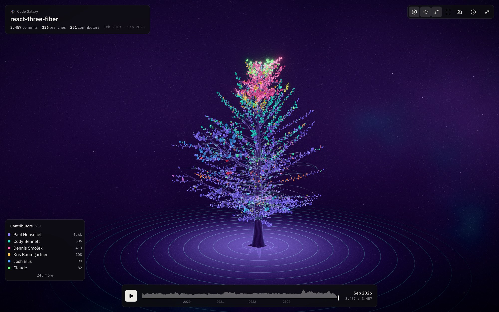
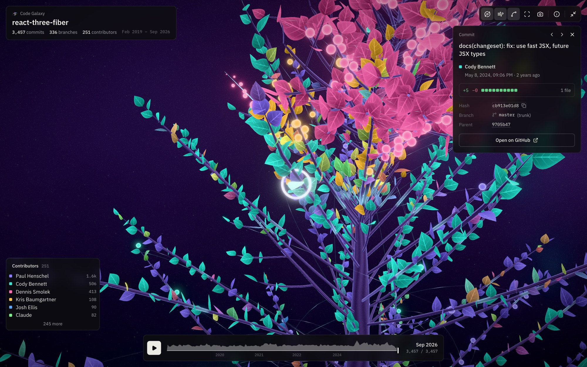

<div align="center">
  
  <h1>Code Galaxy</h1>
  <p><strong>Your Git history, grown into a living 3D tree.</strong></p>
  <p>
    <a href="https://www.npmjs.com/package/code-galaxy"></a>
    <a href="LICENSE"></a>
    
  </p>
</div>

<p align="center">
  
</p>

The main branch is the trunk, every Git branch grows from the commit it started from, and every commit is a leaf,
colored by its author and sized by the lines it changed. Replay years of work in seconds, click any leaf to read the
commit, and watch new leaves appear as you work.

```bash
npx code-galaxy
```

Run it in a Git repository and the tree opens in your browser. Nothing to install, no account, and nothing leaves
your computer.

## Contents

- [Reading the tree](#reading-the-tree)
- [Exploring](#exploring)
- [Opening any repository](#opening-any-repository)
- [Command line](#command-line)
- [Privacy](#privacy)
- [How it works](#how-it-works)
- [Development](#development)

## Reading the tree

| Shape        | Meaning                                                                            |
| ------------ | ---------------------------------------------------------------------------------- |
| **Trunk**    | The first-parent history of the main branch. The first commit sits at the roots.   |
| **Branches** | Git branches, growing from the exact commit they started from. More work, thicker. |
| **Leaves**   | One per commit. The color says who wrote it, the size how many lines it changed.   |
| **Buds**     | Merge commits, lit where a branch joined another one.                              |
| **Arcs**     | A merged branch flowing back to its merge commit. Toggle them with <kbd>M</kbd>.   |

## Exploring

<p align="center">
  
</p>

- **Click a leaf** to fly to it and read the commit: message, author, date, lines added and deleted, branch, parents,
  and a link to GitHub, GitLab, Bitbucket or Codeberg.
- **Replay the growth** with the timeline, or drag it to see the tree at any date.
- **Highlight a contributor** from the list to light up their leaves across the whole history.
- **Keep the tab open**: when you commit, merge or switch branches, the tree follows within seconds.
- **Save a PNG** of the current view, from any angle and any moment of the history.

| Shortcut                    | Action                  |
| --------------------------- | ----------------------- |
| <kbd>Space</kbd>            | Replay the growth       |
| <kbd>←</kbd> / <kbd>→</kbd> | Previous / next commit  |
| <kbd>R</kbd>                | Reset the view          |
| <kbd>A</kbd>                | Auto-rotate             |
| <kbd>W</kbd>                | Wind                    |
| <kbd>M</kbd>                | Show or hide merge arcs |
| <kbd>Esc</kbd>              | Close the commit panel  |

## Opening any repository

- **The repository you are in**: `npx code-galaxy`.
- **Another folder**: `npx code-galaxy ../another-repo`.
- **Anything else**: run `npx code-galaxy` outside a repository and a picker opens in the browser. It lists the
  repositories found on your computer and the ones you opened recently, has a folder browser, and a field where you can
  paste the address of a public repository: `github.com/owner/repo`, `owner/repo`, a GitLab, Bitbucket or Codeberg
  URL, an SSH address, or even a link to one of its pages.

Repositories cloned from an address are kept in `~/.code-galaxy/repos`, history only (no working files), so opening
them again only downloads what changed. Private repositories work too, as long as Git on your computer can already
clone them.

> [!NOTE]
> A ZIP downloaded from GitHub only holds the files of one commit, not the history. Paste the ZIP's link instead:
> Code Galaxy recognizes it and clones the repository itself.

## Command line

```text
code-galaxy [path]                   Open the tree of the repository at path (default: this folder, or the picker)
code-galaxy export [path] [-o file]  Save the history as a .galaxy.json file

-p, --port <number>    Port of the local server (default: 3141)
-t, --trunk <branch>   Branch drawn as the trunk (default: the main branch)
    --no-open          Do not open the browser
    --no-watch         Do not update the tree when new commits are made
```

Requires [Node.js](https://nodejs.org) 20.19 or newer and [Git](https://git-scm.com).

## Privacy

Code Galaxy is a local tool. The command reads the history with Git, then serves the viewer on `localhost` only: the
page is not reachable from other computers, and it refuses requests coming from other websites. Nothing is uploaded
and there is no analytics.

The page receives commit hashes, messages, dates, author names and line counts. Email addresses are only used by the
command to recognize one person under several names, and never reach the page. Source code is never read.

## How it works

1. **Reading.** `git log` gives every commit with its parents and its line counts. The trunk is the first-parent
   chain of the main branch; every other commit is assigned to a branch by following first parents from the tips,
   newest merges first.
2. **Growing.** The layout places each branch on its parent at the commit it started from, with the golden angle used
   by real plants, a crown shape, and a thickness that follows the amount of work it carries (the
   [pipe model](https://en.wikipedia.org/wiki/Pipe_model_theory) of botanists). Commits cluster into twigs so that
   long branches keep a readable shape.
3. **Drawing.** [React Three Fiber](https://r3f.docs.pmnd.rs) draws the wood, the leaves (one instanced mesh for all
   of them) and the arcs. Custom shaders grow each part at the date of its commit, which is how the replay and the
   timeline work without rebuilding anything.

The data format shared by all parts is documented in [`packages/viewer/src/types.ts`](packages/viewer/src/types.ts),
and the layout lives in [`packages/viewer/src/layout`](packages/viewer/src/layout).

## Development

This is an npm workspaces monorepo:

```text
packages/viewer   The 3D scene and its interface, shared by the command and the website.
packages/cli      The `code-galaxy` command published on npm: reads Git, serves the viewer on localhost.
apps/site         The website, deployed on Vercel: presentation and live demos.
scripts           Maintenance scripts (website demos, tricky test histories).
```

```bash
npm install
npm run dev                          # the local app, starting on the repository picker
CG_REPO=../some-repo npm run dev     # ...or directly on a repository
npm run dev:site                     # the website
```

| Script               | What it does                                                                           |
| -------------------- | -------------------------------------------------------------------------------------- |
| `npm run build`      | Builds the command (with the viewer inside) and the website                            |
| `npm run typecheck`  | Type-checks every workspace                                                            |
| `npm run format`     | Formats the code with Prettier                                                         |
| `npm run demos`      | Rebuilds the website demos (clones a few public repositories)                          |
| `npm run edge-cases` | Generates tricky histories (git-flow, orphan branch, broken clocks) to test the layout |

To try the built command: `npm run build:cli && node packages/cli/dist/cli.js ../some-repo`.

### Deploying the website

On Vercel, import the repository and set **Root Directory** to `apps/site`. Vercel installs the workspaces from the
repository root and only builds the website. `VITE_GITHUB_URL` overrides the GitHub link shown on the site.

### Publishing the command

Only `packages/cli` is published; its build embeds the compiled viewer.

```bash
npm run build:cli
npm publish -w code-galaxy
```

Pushing a `v*` tag runs the release workflow, which publishes the package from GitHub Actions (it needs an `NPM_TOKEN`
repository secret).

## License

[MIT](LICENSE)
